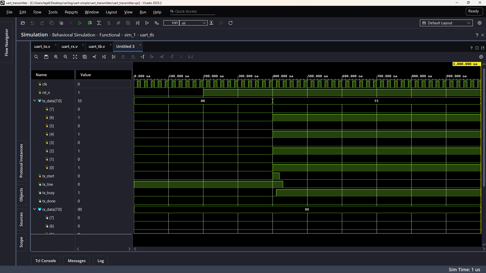
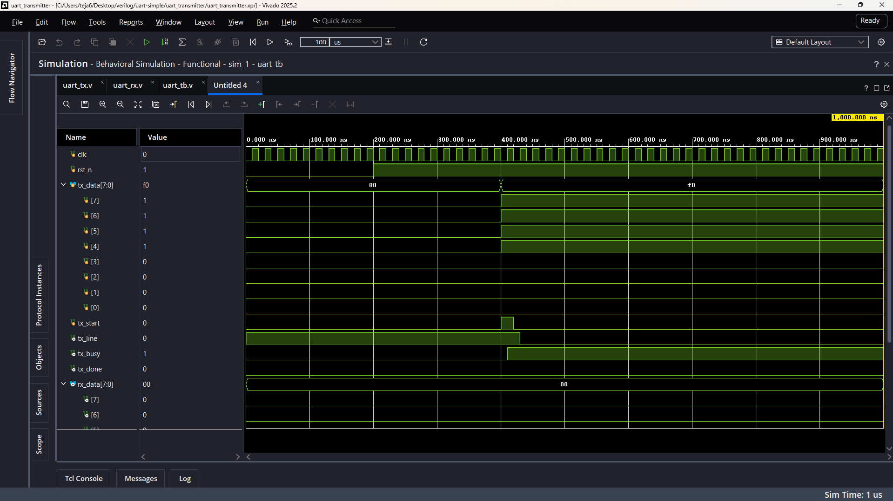

# Verilog UART Transceiver

A simple UART transmitter and receiver implemented in Verilog and verified using RTL simulation in Vivado.

### Configuration
- 50 MHz clock
- 115200 baud
- 8-bit data
- 1 stop bit
- No parity

### Verification

TX and RX were connected together and tested with different data patterns.

**0x55**

**0xF0**

### Next

Next project: **SPI Master in Verilog**
